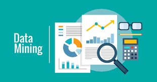
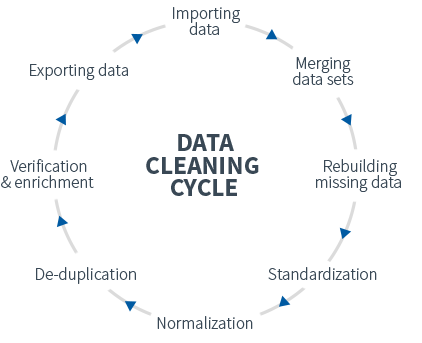
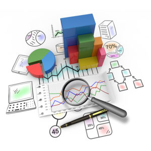

# Data-Science

Data science is an inter-disciplinary field that uses scientific methods, processes, algorithms and systems to extract knowledge and insights from many structural and unstructured data. Today it has become one of the most desirable roles and high paying roles in the Industry. It has various aspects to it be it Data Collection, Visualisation, Modelling etc.  which all are done with a Business objective in the mind.

 
 

## 1) Business Understanding
It refers to the thing one need to do in order to better understand its task. For example-  
I am working in a Film indrustry and I want to see whether a movie will be a hit in my Hall. Now the task I have is to find out whether the movie will be a hit or not. Now in order  to correctly predict this I will need some information which will as follows-  
a) Who is the director of the Movie  
b) How trending is the Movie related chats on the Social Media  
c) Who is the actor  
d) What is the budget  
e) What is it's genere  
and many more such question. This part  is called Business Understanding.  

## 2) Data Mining
In simple words, data mining is defined as a process used to extract usable data from a larger set of any raw data. It implies analysing data patterns in large batches of data using one or more software. Data mining has applications in multiple fields, like science and research. As an application of data mining, businesses can learn more about their customers and develop more effective strategies related to various business functions and in turn leverage resources in a more optimal and insightful manner. This helps businesses be closer to their objective and make better decisions. Data mining involves effective data collection and warehousing as well as computer processing. For segmenting the data and evaluating the probability of future events, data mining uses sophisticated mathematical algorithms. Data mining is also known as Knowledge Discovery in Data (KDD).
 

###   The Data Mining Process:  
  Technological Infrastructure Required:  
  1. Database Size: For creating a more powerful system more data is required to processed and maintained.  
  2. Query complexity: For querying or processing more complex queries and the greater the number of queries, the more powerful system is required. 
  
    
  
  Uses:  
  1. Data mining techniques are useful in many research projects, including mathematics, cybernetics, genetics and marketing.  
  2. With data mining, a retailer could manage and use point-of-sale records of customer purchases to send targeted promotions based on an individual’s purchase history. The   retailer could also develop products and promotions to appeal to specific customer segments based on mining demographic data from comment or warranty cards.  
  
  
## 3) Data Cleaning  
Data cleansing or data cleaning is the process of detecting and correcting (or removing) corrupt or inaccurate records from a record set, table, or database and refers to identifying incomplete, incorrect, inaccurate or irrelevant parts of the data and then replacing, modifying, or deleting the dirty or coarse data. For example -  
In my dataset I may have many cell which has no value in them which is entirely possible by mystake during data gathering from the source, it could also have data inclined towards a side, also the data could be corrupt at some places ( string instead of a integer ) and such situations are taken care of in this place.  

 

           
The most popular tool used for doing this is SQL ( Structured Query Language ) obviously cause it's easy to use and have a very high interpretability. 
         
 
 
    
## 4) Data Exploration  

 
This is one of the most interesting and insightful part of the whole Data Cycle.  
Data exploration is the initial step in data analysis, where users explore a large data set in an unstructured way to uncover initial patterns, characteristics, and points of interest. This process isn’t meant to reveal every bit of information a dataset holds, but rather to help create a broad picture of important trends and major points to study in greater detail.  

Data exploration can use a combination of manual methods and automated tools such as data visualizations, charts, and initial reports.      

## 5) Feature Engineering  

Feature engineering is the process of using domain knowledge to extract features from raw data via data mining techniques. These features can be used to improve the performance of machine learning algorithms. Feature engineering can be considered as applied machine learning itself.
 
This is the place which decides the outcome fo your model. If you input features are good only then the Lernning Algorithms could perform well.  

## 6) Predictive Modelling

Finally the thing for which we did all the previous steps. Now based on the data and the objective we build a model ( a sort of algorithimic set ). The model making is divided into 2 part's training and testing/validation. In training we show what happens if you have this kind of information. In testing/validation we look that after showing the model what happens can he deduce what will happen if a relatively similar information is given and if necessary change the model accordingly and finally in that model will be used to predict the outcome of a situation given sertain information and the correlation among them which it learnt during training.

 

## 7) Data Visualization

We finally make a attractive and insightful report of our data and present it to Others in an easy to Understand way. This is what you worked hard for so now it's time to enjoy the results and take according actions 👍👍✨✨

### In a nut shell

